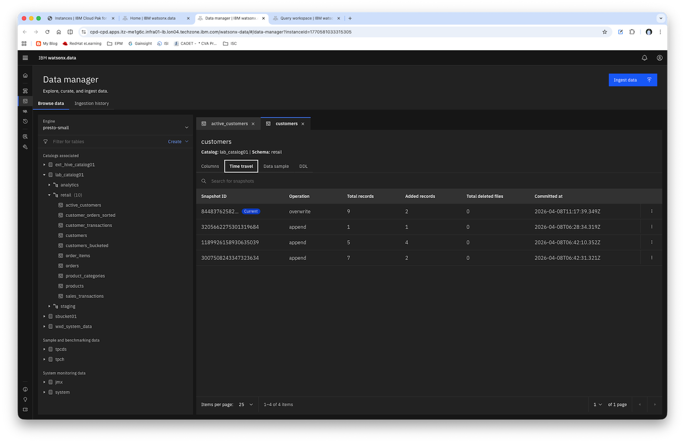
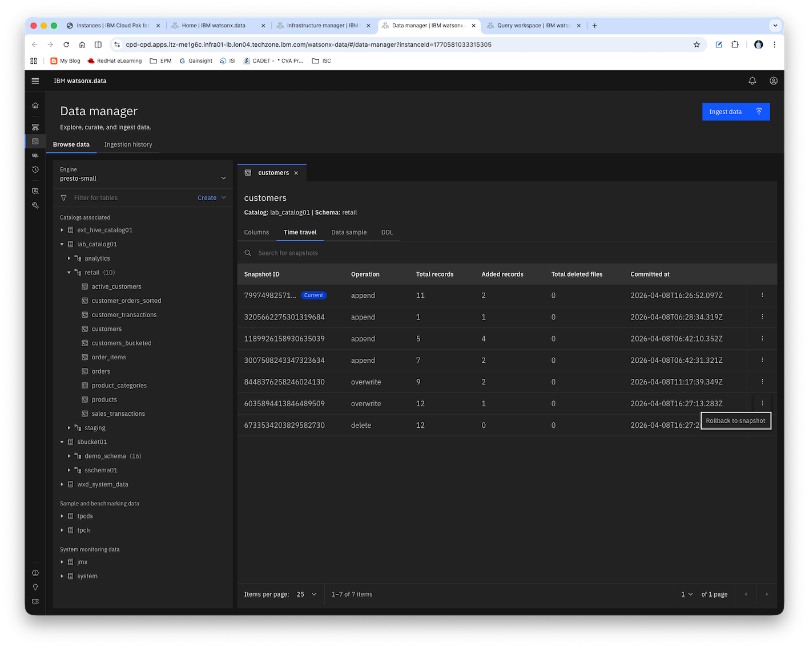

# Lab 5: Time Travel and Rollback Operations

**Duration:** 60 minutes  
**Difficulty:** Intermediate  
**Prerequisites:** Completion of Labs 1-4

---

## Lab Objectives

By the end of this lab, you will be able to:
- Query historical data using time travel
- View and manage table snapshots
- Rollback tables to previous states
- Understand snapshot retention policies
- Implement data recovery strategies
- Use snapshot metadata for auditing

---

## Part 1: Understanding Iceberg Snapshots (10 minutes)

### Step 1: View Current Snapshots

1. Navigate to **Query Workspace**

2. View snapshots for the customers table:
   ```sql
   SELECT
       snapshot_id,
       parent_id,
       committed_at,
       operation,
       summary
   FROM lab_catalog01.retail."customers$snapshots"
   ORDER BY committed_at DESC;
   ```

3. Understand the snapshot information:
   - `snapshot_id`: Unique identifier for the snapshot
   - `parent_id`: Previous snapshot ID
   - `committed_at`: Timestamp when the snapshot was created
   - `operation`: Type of operation (append, overwrite, delete)
   - `summary`: Statistics about the operation



### Step 2: View Snapshot History

1. Check the history of changes:
   ```sql
   SELECT 
       made_current_at,
       snapshot_id,
       parent_id,
       is_current_ancestor
   FROM lab_catalog01.retail."customers$history"
   ORDER BY made_current_at DESC;
   ```

2. Count total snapshots:
   ```sql
   SELECT COUNT(*) as total_snapshots
   FROM lab_catalog01.retail."customers$snapshots";
   ```

### Step 3: View Snapshot Files

1. See files associated with current snapshot:
   ```sql
   SELECT 
       content,
       file_path,
       file_format,
       record_count,
       file_size_in_bytes / 1024 / 1024 as size_mb
   FROM lab_catalog01.retail."customers$files"
   LIMIT 10;
   ```

---

## Part 2: Time Travel Queries (15 minutes)

### Step 1: Create Test Data with Timestamps

1. Record current state:
   ```sql
   SELECT COUNT(*) as current_count
   FROM lab_catalog01.retail.customers;
   ```

2. Note the current timestamp:
   ```sql
   SELECT CURRENT_TIMESTAMP as query_time;
   ```

3. Insert new customers:
   ```sql
   INSERT INTO lab_catalog01.retail.customers VALUES
   (100, 'TimeTravel', 'User1', 'tt1@email.com', '+1-555-0200',
    '100 Time St', 'Boston', 'MA', '02101', 'USA',
    CURRENT_DATE, CURRENT_DATE, 0.00, 'ACTIVE'),
   (101, 'TimeTravel', 'User2', 'tt2@email.com', '+1-555-0201',
    '101 Time St', 'Boston', 'MA', '02101', 'USA',
    CURRENT_DATE, CURRENT_DATE, 0.00, 'ACTIVE');
   ```

4. Wait a moment, then update a customer:
   ```sql
   UPDATE lab_catalog01.retail.customers
   SET customer_status = 'PREMIUM', total_purchases = 5000.00
   WHERE customer_id = 100;
   ```

5. Delete a customer:
   ```sql
   DELETE FROM lab_catalog01.retail.customers
   WHERE customer_id = 101;
   ```

### Step 2: Query Historical Data by Snapshot ID

1. Get the snapshot IDs:
   ```sql
   SELECT
       snapshot_id,
       committed_at,
       operation,
       summary
   FROM lab_catalog01.retail."customers$snapshots"
   ORDER BY committed_at DESC
   LIMIT 5;
   ```

2. Query data at a specific snapshot (use a snapshot ID from above):
   ```sql
   SELECT *
   FROM lab_catalog01.retail.customers FOR VERSION AS OF <snapshot_id>
   WHERE customer_id IN (100, 101);
   ```

### Step 3: Query Historical Data by Timestamp

1. Query data as of a specific timestamp (before the updates):
   ```sql
   SELECT COUNT(*) as count_at_timestamp
   FROM lab_catalog01.retail.customers
   FOR TIMESTAMP AS OF TIMESTAMP '2026-03-30 10:00:00';
   ```

2. Compare with current count:
   ```sql
   SELECT
       (SELECT COUNT(*) FROM lab_catalog01.retail.customers) as current_count,
       (SELECT COUNT(*) FROM lab_catalog01.retail.customers
        FOR TIMESTAMP AS OF TIMESTAMP '2026-03-30 10:00:00') as historical_count;
   ```

### Step 4: Audit Changes Over Time

1. Track changes to a specific customer:
   ```sql
   -- Current state
   SELECT 'CURRENT' as version, *
   FROM lab_catalog01.retail.customers
   WHERE customer_id = 100
   
   UNION ALL
   
   -- Historical state (use appropriate snapshot ID)
   SELECT 'SNAPSHOT_<id>' as version, *
   FROM lab_catalog01.retail.customers FOR VERSION AS OF <snapshot_id>
   WHERE customer_id = 100;
   ```

---

## Part 3: Rolling Back Tables (15 minutes)

### Step 1: Prepare for Rollback

1. Record current state before rollback:
   ```sql
   CREATE TABLE lab_catalog01.staging.customers_backup
   AS SELECT * FROM lab_catalog01.retail.customers;
   ```

2. Get the snapshot ID to rollback to:
   ```sql
   SELECT
       snapshot_id,
       committed_at,
       operation
   FROM lab_catalog01.retail."customers$snapshots"
   ORDER BY committed_at DESC;
   ```

### Step 2: Rollback to Previous Snapshot

1. Rollback using snapshot ID:
   ```sql
   CALL lab_catalog01.system.rollback_to_snapshot(
       'retail',
       'customers',
       <snapshot_id>
   );
   ```

   **Syntax Explanation:**
   - `rollback_to_snapshot`: System procedure that rolls back a table to a specific snapshot
   - First parameter (`'retail'`): Schema name where the table resides
   - Second parameter (`'customers'`): Table name to rollback
   - Third parameter (`<snapshot_id>`): The specific snapshot ID to rollback to (obtained from the `customers$snapshots` metadata table)
   
   The procedure will restore the table to the exact state captured in the specified snapshot.

   **Alternative: Using the UI**
   
   You can also perform rollback operations through the watsonx.data UI:
   1. Navigate to **Data Manager**
   2. Select the table you want to rollback
   3. Click on the **Time Travel** tab
   4. Browse the list of available snapshots
   5. Select the desired snapshot
   6. Click **Rollback** to restore the table to that snapshot
   
   

2. Verify the rollback:
   ```sql
   SELECT COUNT(*) as count_after_rollback
   FROM lab_catalog01.retail.customers;
   ```

3. Check if deleted customer is restored:
   ```sql
   SELECT *
   FROM lab_catalog01.retail.customers
   WHERE customer_id = 101;
   ```

### Step 3: Rollback to Timestamp

1. Rollback to a specific timestamp:
   ```sql
   CALL lab_catalog01.system.rollback_to_timestamp(
       'retail',
       'customers',
       TIMESTAMP '2026-03-30 10:00:00'
   );
   ```

   **Syntax Explanation:**
   - `rollback_to_timestamp`: System procedure that rolls back a table to its state at a specific point in time
   - First parameter (`'retail'`): Schema name where the table resides
   - Second parameter (`'customers'`): Table name to rollback
   - Third parameter (`TIMESTAMP '2026-03-30 10:00:00'`): Target timestamp to rollback to
   
   The procedure will find the snapshot that was current at the specified timestamp and restore the table to that state.

2. Verify the rollback:
   ```sql
   SELECT 
       customer_id,
       first_name,
       last_name,
       customer_status,
       total_purchases
   FROM lab_catalog01.retail.customers
   WHERE customer_id IN (100, 101);
   ```

---

## Part 4: Managing Snapshots (10 minutes)

### Step 1: Expire Old Snapshots

1. View snapshot retention:
   ```sql
   SELECT
       snapshot_id,
       committed_at,
       CAST((CURRENT_TIMESTAMP - committed_at) AS VARCHAR) as age
   FROM lab_catalog01.retail."customers$snapshots"
   ORDER BY committed_at;
   ```

2. Expire snapshots older than a certain time:
   ```sql
   CALL lab_catalog01.system.expire_snapshots(
       schema => 'retail',
       table_name => 'customers',
       older_than => TIMESTAMP '2026-04-08 00:00:00',
       retain_last => 5
   );
   ```

   **Important Notes:**
   - `older_than`: Only snapshots created **before** this timestamp are eligible for expiration
   - `retain_last`: Guarantees that at least this many snapshots will be kept, **regardless** of the `older_than` parameter
   - **Result**: You will see **at least 5 snapshots** remaining, even if more than 5 snapshots are older than the specified timestamp
   - The procedure keeps the 5 most recent snapshots plus any snapshots newer than the `older_than` timestamp
   - This is by design to prevent accidental deletion of all snapshots and maintain data recovery capabilities

3. Verify snapshots were expired:
   ```sql
   SELECT COUNT(*) as remaining_snapshots
   FROM lab_catalog01.retail."customers$snapshots";
   ```
---

## Part 5: Data Recovery Scenarios (15 minutes)

### Step 1: Accidental DELETE Recovery

1. Simulate accidental deletion:
   ```sql
   -- Record count before deletion
   SELECT COUNT(*) as before_delete
   FROM lab_catalog01.retail.orders;

   -- Accidentally delete all orders from a specific date
   DELETE FROM lab_catalog01.retail.orders
   WHERE order_date = DATE '2024-03-25';
   
   -- Check count after deletion
   SELECT COUNT(*) as after_delete
   FROM lab_catalog01.retail.orders;
   ```

2. Find the snapshot before deletion:
   ```sql
   SELECT
       snapshot_id,
       committed_at,
       operation,
       summary
   FROM lab_catalog01.retail."orders$snapshots"
   ORDER BY committed_at DESC
   LIMIT 3;
   ```

3. Recover by rolling back:
   ```sql
   CALL lab_catalog01.system.rollback_to_snapshot(
       'retail',
       'orders',
       <snapshot_id_before_delete>
   );
   ```

4. Verify recovery:
   ```sql
   SELECT COUNT(*) as after_recovery
   FROM lab_catalog01.retail.orders;
   ```

### Step 2: Incorrect UPDATE Recovery

1. Simulate incorrect update:
   ```sql
   -- Update all customers to INACTIVE (mistake!)
   UPDATE lab_catalog01.retail.customers
   SET customer_status = 'INACTIVE';
   
   -- Check the damage
   SELECT 
       customer_status,
       COUNT(*) as count
   FROM lab_catalog01.retail.customers
   GROUP BY customer_status;
   ```

2. Recover using time travel:
   ```sql
   -- Create corrected table from historical data
   CREATE TABLE lab_catalog01.staging.customers_corrected
   AS
   SELECT *
   FROM lab_catalog01.retail.customers
   FOR VERSION AS OF <snapshot_id_before_update>;
   ```

3. Replace current data:
   ```sql
   -- Truncate current table
   DELETE FROM lab_catalog01.retail.customers;

   -- Restore from backup
   INSERT INTO lab_catalog01.retail.customers
   SELECT * FROM lab_catalog01.staging.customers_corrected;
   ```

4. Verify recovery:
   ```sql
   SELECT 
       customer_status,
       COUNT(*) as count
   FROM lab_catalog01.retail.customers
   GROUP BY customer_status;
   ```

### Step 3: Schema Evolution Recovery

1. Add a column:
   ```sql
   ALTER TABLE lab_catalog01.retail.products
   ADD COLUMN discount_eligible BOOLEAN;
   ```

2. Update with new column:
   ```sql
   UPDATE lab_catalog01.retail.products
   SET discount_eligible = true
   WHERE category = 'Electronics';
   ```

3. Query historical data (before column was added):
   ```sql
   SELECT *
   FROM lab_catalog01.retail.products
   FOR VERSION AS OF <old_snapshot_id>
   LIMIT 5;
   ```

4. Note that historical queries work even with schema changes

---


## Verification Checklist

Mark each item as you complete it:

- [ ] Viewed table snapshots and history
- [ ] Performed time travel queries by snapshot ID
- [ ] Performed time travel queries by timestamp
- [ ] Rolled back table to previous snapshot
- [ ] Rolled back table to specific timestamp
- [ ] Expired old snapshots
- [ ] Recovered from accidental DELETE
- [ ] Recovered from incorrect UPDATE

---

## Lab Questions

Answer the following questions:

1. **What is the difference between snapshot ID and timestamp-based time travel?**
   
   Answer: _________________

2. **How many snapshots are retained by default?**
   
   Answer: _________________

3. **Can you query data after a schema change using time travel?**
   
   Answer: _________________

4. **What happens to snapshots when you expire them?**
   
   Answer: _________________

5. **What is the recommended snapshot retention period?**
   
   Answer: _________________

---

## Time Travel Scenarios Table

Document your time travel experiments:

| Scenario | Snapshot ID | Timestamp | Records Before | Records After | Success? |
|----------|-------------|-----------|----------------|---------------|----------|
| Initial state | _______ | _______ | _______ | _______ | _______ |
| After INSERT | _______ | _______ | _______ | _______ | _______ |
| After UPDATE | _______ | _______ | _______ | _______ | _______ |
| After DELETE | _______ | _______ | _______ | _______ | _______ |
| After rollback | _______ | _______ | _______ | _______ | _______ |

---

## Best Practices

### Time Travel
- ✓ Use snapshot IDs for precise point-in-time queries
- ✓ Use timestamps for approximate historical queries
- ✓ Document important snapshot IDs for recovery
- ✓ Test time travel queries before production use
- ✗ Don't rely on very old snapshots (may be expired)

### Rollback
- ✓ Always backup current state before rollback
- ✓ Verify snapshot exists before attempting rollback
- ✓ Test rollback in non-production first
- ✓ Document rollback procedures
- ✗ Don't rollback without understanding the impact

### Snapshot Management
- ✓ Set appropriate retention policies
- ✓ Regularly expire old snapshots to save storage
- ✓ Keep at least 7 days of snapshots for recovery
- ✓ Monitor snapshot storage usage
- ✗ Don't expire snapshots too aggressively

### Data Recovery
- ✓ Have a documented recovery plan
- ✓ Practice recovery procedures regularly
- ✓ Use time travel for quick recovery
- ✓ Maintain separate backups for critical data
- ✓ Test recovery procedures in non-production

---

## SQL Reference Sheet

### View Snapshots
```sql
-- List snapshots
SELECT * FROM catalog.schema."table$snapshots";

-- View history
SELECT * FROM catalog.schema."table$history";

-- View files
SELECT * FROM catalog.schema."table$files";
```

### Time Travel Queries
```sql
-- Query by snapshot ID
SELECT * FROM table FOR VERSION AS OF snapshot_id;

-- Query by timestamp
SELECT * FROM table FOR TIMESTAMP AS OF TIMESTAMP 'yyyy-mm-dd hh:mm:ss';
```

### Rollback Operations
```sql
-- Rollback to snapshot
CALL catalog.system.rollback_to_snapshot('schema', 'table', snapshot_id);

-- Rollback to timestamp
CALL catalog.system.rollback_to_timestamp('schema', 'table', TIMESTAMP 'yyyy-mm-dd hh:mm:ss');
```

### Snapshot Management
```sql
-- Expire snapshots
CALL catalog.system.expire_snapshots(
    schema => 'schema_name',
    table_name => 'table_name',
    older_than => TIMESTAMP 'yyyy-mm-dd hh:mm:ss',
    retain_last => 5
);

-- Set retention policy
ALTER TABLE catalog.schema.table
SET PROPERTIES 'history.expire.max-snapshot-age-ms' = '604800000';
```

---

## Troubleshooting

### Issue: Cannot find snapshot
**Solution:**
- Check if snapshot was expired
- Verify snapshot ID is correct
- Use `$snapshots` table to list available snapshots
- Check retention policies

### Issue: Time travel query fails
**Solution:**
- Verify timestamp format is correct
- Ensure timestamp is within retention period
- Check if table existed at that time
- Verify you have read permissions

### Issue: Rollback fails
**Solution:**
- Verify snapshot exists
- Check if you have write permissions
- Ensure no concurrent operations
- Verify table is not locked

### Issue: Too many snapshots
**Solution:**
- Run expire_snapshots procedure
- Adjust retention policy
- Monitor snapshot creation rate
- Consider compaction

---

## Additional Resources

- [Apache Iceberg Time Travel](https://iceberg.apache.org/docs/latest/spark-queries/#time-travel)
- [Iceberg Snapshot Management](https://iceberg.apache.org/docs/latest/maintenance/)
- [watsonx.data Time Travel Guide](https://www.ibm.com/docs/en/watsonxdata)

---

## Next Steps

Proceed to **[Lab 6: Spark Application Development](LAB06_Spark_Application_Development.md)** where you will:
- Provision Spark engines
- Develop Spark applications
- Execute Spark jobs
- Monitor Spark execution
- Integrate Spark with Iceberg tables

---

**Lab Completed!** ✓

Please inform your instructor that you have completed Lab 5 before proceeding to Lab 6.