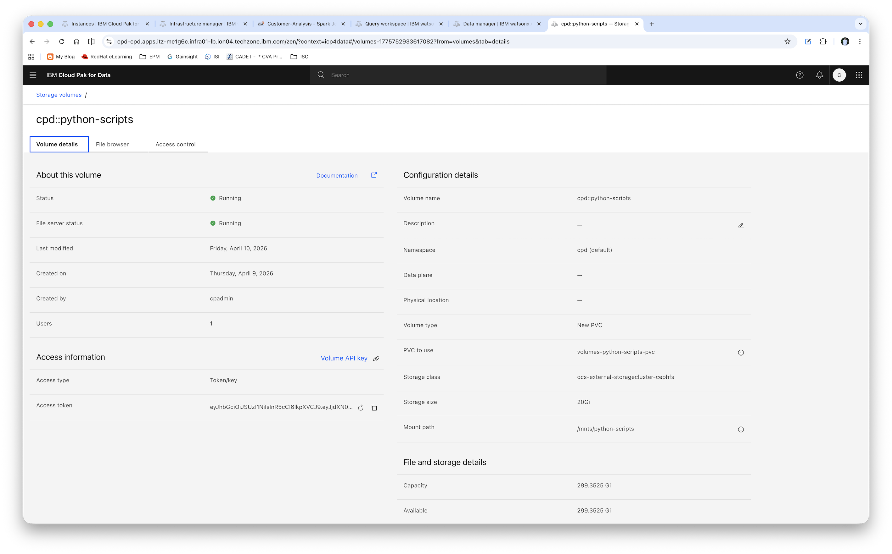
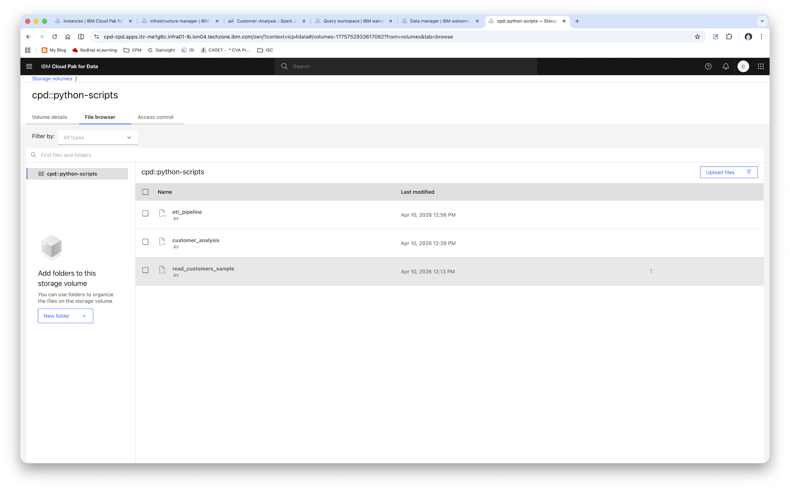
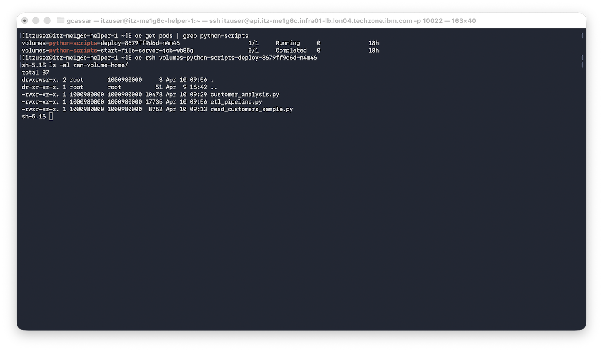
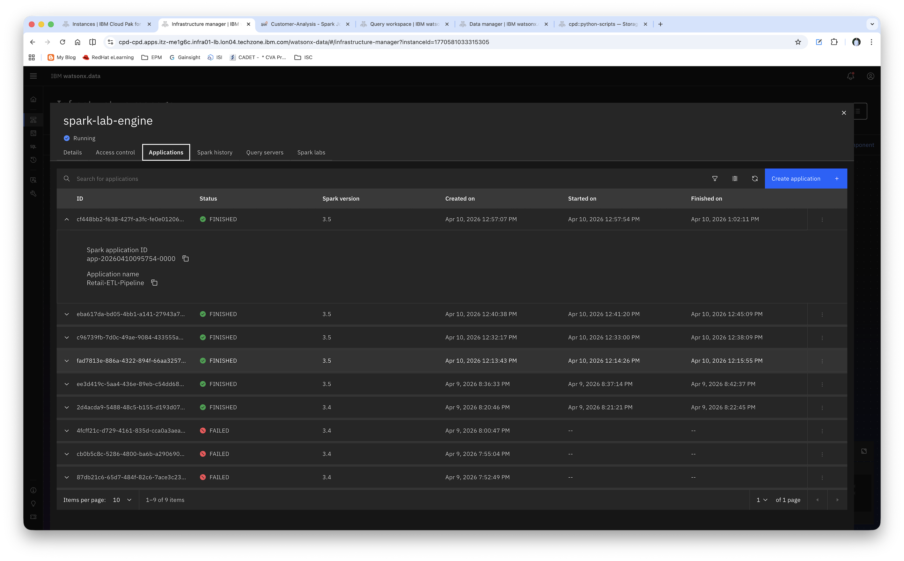
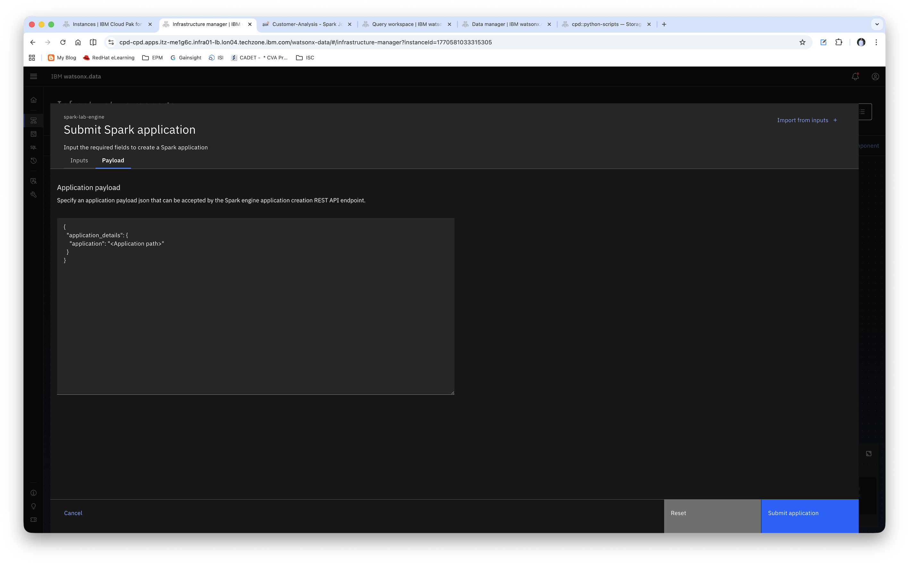

# Lab 6: Spark Application Development

**Duration:** 90 minutes
**Difficulty:** Advanced
**Prerequisites:** Completion of Labs 1-5, Python 3.8+, Basic PySpark knowledge
**Last Updated:** April 2026

---

## Lab Objectives

By the end of this lab, you will be able to:
- Provision and configure Spark engines in watsonx.data
- Develop PySpark applications for data processing
- Execute Spark SQL queries on Iceberg tables
- Submit Spark jobs via UI, CLI, and API

---

## Part 1: Provisioning Spark Engine (15 minutes)

### Step 1: Create Spark Engine via UI

1. Navigate to **Infrastructure Manager** in watsonx.data console

2. Click on **Add component** button

3. Select **Spark** as the component type

4. **General Information:**
   - **Type**: Spark (selected from dropdown)
   - **Display name**: Enter a descriptive name (e.g., `spark-lab-engine`)

5. **Engine Configuration:**
   
   **Registration mode:**
   - Select **Create a native Spark engine** (recommended for this lab)
   - Alternative: **Register an external Spark engine** (for existing Spark clusters)
   
   **Default Spark version:**
   - Select **3.4** (or latest available version)

6. **Engine Home:**
   
   **Storage options:**
   - Select **New volume** (creates dedicated storage for this engine)
   - Alternative: **Existing volume** (if you have a pre-configured volume)
   
   **Volume name:**
   - Enter a unique name (e.g., `spark-lab-volume`)
   - Note: Volume names can only contain alphanumeric characters and hyphens
   - Cannot start or end with hyphens
   
   **Storage class:**
   - Select **ocs-external-storagecluster-cephfs** (or appropriate storage class for your environment)
   - This determines the underlying storage provisioner
   - Warning: Storage classes that provision block storage may cause errors when creating storage volumes
   
   **Size of the new storage volume:**
   - Use the slider to set size (default: 5 GB, max: 1024 GB)
   - Recommended: 5-10 GB for lab exercises
   - Consider your data volume and application requirements

7. **Associated Catalogs (Optional):**
   
   - Click **Select all** to associate all available catalogs, or
   - Manually select specific catalogs:
     - ☑ `lab_catalog01` (required for this lab)
     - ☑ `iceberg_data` (if available)
   
   **Note:** You can modify catalog associations later if needed

8. **Review and Create:**
   - Click **Back** if you need to modify any settings
   - Click **Create** to provision the Spark engine
   - Wait for the engine status to change to **Running** (this may take 2-5 minutes)

9. **Verify Engine Creation:**
   - The engine should appear in the Infrastructure Manager with status **Running**
   - Note the engine ID for use in API/CLI operations

---

## Part 2: Preparing Application Files (10 minutes)

### Step 1: Upload Python Scripts to Persistent Volume

Before submitting Spark jobs, you need to upload your Python application files to a persistent volume that the Spark engine can access.

#### Option A: Using Software Hub (Recommended)

1. **Navigate to Software Hub → Storage Volumes**

2. **Access the Persistent Volume:**
   - Locate the persistent volume
   - Volume name format: `spark-lab-volume` or similar
   
   

3. **Create Application Directory:**
   - Navigate to the volume's file system
   - In our lab we will be using the root directory, but in production environments create directories for your applications (e.g., `/apps`)
   - This keeps your applications organized
   
   

4. **Upload Python Files:**
   - Upload the following files to your application directory:
     - `customer_analysis.py` - Customer analysis application
     - `etl_pipeline.py` - ETL pipeline application
     - `read_customers_sample.py` - Sample read operation (optional)
   - Note the full path to these files (e.g., `/spark-lab-volume/apps/customer_analysis.py`)
   - You'll need these paths when submitting jobs

### Step 2: Verify Persistent Volume and Pod (Advanced)

When you create a persistent volume via Software Hub, OpenShift automatically creates a deployment pod to serve the files.

#### A. Check the Pod Status

```bash
# List pods related to your persistent volume
oc get pods | grep python-scripts

# Example output:
# volumes-python-scripts-deploy-8679ff9d6d-n4m46      1/1  Running    0  18h
# volumes-python-scripts-start-file-server-job-wb85g  0/1  Completed  0  18h
```

**Pod Types:**
- **Deploy pod** (e.g., `volumes-python-scripts-deploy-*`): Running pod that serves the volume files
- **Start job pod** (e.g., `volumes-python-scripts-start-file-server-job-*`): Completed initialization job

#### B. Access Files via OpenShift CLI

You can verify your uploaded files by accessing the pod directly:

```bash
# Remote shell into the deploy pod
oc rsh volumes-python-scripts-deploy-8679ff9d6d-n4m46

# List files in the zen-volume-home directory
sh-5.1$ ls -al zen-volume-home/
total 37
drwxrwsr-x. 2 root       1000980000     3 Apr 10 09:56 .
dr-xr-xr-x. 1 root       root          51 Apr  9 16:42 ..
-rwxr-xr-x. 1 1000980000 1000980000 10478 Apr 10 09:29 customer_analysis.py
-rwxr-xr-x. 1 1000980000 1000980000 17735 Apr 10 09:56 etl_pipeline.py
-rwxr-xr-x. 1 1000980000 1000980000  8752 Apr 10 09:13 read_customers_sample.py

# Exit the pod
sh-5.1$ exit
```



**Key Observations:**
- Files are stored in the `zen-volume-home/` directory within the pod
- File permissions show they are accessible (rwxr-xr-x)
- File sizes confirm successful uploads
- The pod provides a file server interface for Spark to access these files

#### C. Understanding File Paths

When submitting Spark jobs, you'll reference files using the volume mount path:

**In Software Hub UI:** Files appear at `/mnts/python-scripts`
**In Spark Job Submission:** Reference as `/mnts/python-scripts`

**Important Notes:**
- The persistent volume pod must be in "Running" status for Spark jobs to access files
- If the pod is not running, check the deployment status in OpenShift

#### Option B: Using Object Storage (S3/COS)

Alternatively, you can store your Python scripts in object storage:
- Upload files to an S3 or Cloud Object Storage bucket
- Ensure the Spark engine has access to the bucket

**Important Notes:**
- Python files must be accessible to the Spark driver and executors
- Persistent volumes provide better performance for frequently used scripts
- Object storage is better for large-scale deployments and version control

---

## Part 3: PySpark Application Development (15 minutes)

### Step 1: Customer Analysis Application

This application analyzes customer purchase patterns and generates summary reports.

**📄 Python Application:**
- **File:** [`python-scripts/customer_analysis.py`](python-scripts/customer_analysis.py)
- **Description:** Comprehensive customer analysis with proper error handling, logging, and resource management
- **Features:**
  - Reads customer and order data from Iceberg tables
  - Joins and aggregates data to create customer summaries
  - Identifies top customers by spending
  - Analyzes sales patterns by geographic location
  - Writes results to analytics table
  - Global configuration constants for easy maintenance
  - Performance monitoring with execution timing

**📋 JSON Payload for Submission:**
- **File:** [`python-scripts/customer_analysis.json`](python-scripts/customer_analysis.json)
- **Purpose:** Defines resource allocation when submitting the job via watsonx.data UI or API
- **Configuration includes:**
  - Driver and executor memory allocation
  - Number of executor cores and instances
  - Application file location
  - Spark configuration parameters

**Key Implementation Highlights:**
- Global configuration constants (catalog, schema, table names)
- Comprehensive error handling and logging with timestamps
- DataFrame caching for performance optimization
- Proper resource cleanup (unpersist cached DataFrames)
- Exit codes for automation (0=success, 1=failure)

### Step 2: ETL Pipeline Application (Medallion Architecture)

This application implements a multi-layer data processing pipeline following the Medallion architecture (Bronze → Silver → Gold).

**📄 Python Application:**
- **File:** [`python-scripts/etl_pipeline.py`](python-scripts/etl_pipeline.py)
- **Description:** Complete ETL pipeline with layered data architecture
- **Architecture Layers:**
  - **Bronze Layer:** Raw data ingestion with metadata tracking
  - **Silver Layer:** Cleaned, validated, and enriched data
  - **Gold Layer:** Business-level aggregates and analytics
- **Features:**
  - Data quality validation and cleansing
  - Partitioned Iceberg tables for performance
  - Customer segmentation (VIP/PREMIUM/REGULAR/NEW)
  - Daily sales summaries with metrics
  - Global configuration constants for all tables and thresholds

**📋 JSON Payload for Submission:**
- **File:** [`python-scripts/etl_pipeline.json`](python-scripts/etl_pipeline.json)
- **Purpose:** Resource configuration for ETL pipeline execution
- **Optimized for:** Multi-stage data processing with higher resource requirements

**Pipeline Workflow:**
1. **Bronze Layer:** Load raw orders with ingestion timestamp
2. **Silver Layer:** Apply data quality rules and business transformations
3. **Gold Layer:** Create business aggregates (daily sales, customer segments)

**Configuration Constants:**
- Catalog and schema names
- Source and target table names
- Business logic thresholds (amount categories, customer segments)
- Spark configuration parameters

### Step 3: Understanding the JSON Payloads

The JSON payload files define how Spark jobs are submitted and configured in watsonx.data. They specify:

**Resource Allocation:**
```json
{
  "application_details": {
    "application": "/path/to/your/script.py",
    "conf": {
      "spark.driver.memory": "2g",
      "spark.driver.cores": "1",
      "spark.executor.memory": "2g",
      "spark.executor.cores": "1",
      "spark.executor.instances": "1"
    }
  }
}
```

**Important Notes:**
- Resource allocation (driver/executor memory, cores, instances) is NOT configured in the Python code
- These settings are defined in the JSON payload when submitting the job
- This separation allows the same code to run with different resource configurations

---

## Part 4: Submitting Spark Jobs (25 minutes)

### Step 1: Submit Job via Web UI

#### A. Navigate to Application Submission

1. **Access the Spark Engine:**
   - Navigate to **Infrastructure Manager** in watsonx.data console
   - Locate your Spark engine (e.g., `spark-lab-engine`)
   - Click on the engine to view details

2. **Create New Application:**
   - Click **Create Application** button
   - This opens the application submission form

   

#### B. Configure Application Details

3. **Application Information:**
   
   **Application file path:**
   - Enter the full path to your Python script on the persistent volume
   - Example: `/spark-lab-volume/apps/customer_analysis.py`
   - Or use S3 path: `s3://my-bucket/apps/customer_analysis.py`
   
   **Application name:** (Optional)
   - Enter a descriptive name: `Customer Analysis Job`
   - Helps identify the job in monitoring dashboards

4. **Resource Configuration:**
   
   You can configure resources in two ways:
   
   **Option A: Manual Configuration (UI Form)**
   - **Driver Memory**: `2g` (2 GB)
   - **Driver Cores**: `1`
   - **Executor Memory**: `2g` (2 GB)
   - **Executor Cores**: `1`
   - **Number of Executors**: `1`
   
   **Option B: JSON Payload (Advanced)**
   - Click **Use JSON** or **Advanced Configuration**
   - Paste contents from [`python-scripts/customer_analysis.json`](python-scripts/customer_analysis.json)
   - This automatically populates all resource fields

   

5. **Submit the Job:**
   - Review all configuration settings
   - Click **Submit** to start the job
   - Note the Application ID for monitoring

**JSON Payload Files Available:**
- [`python-scripts/customer_analysis.json`](python-scripts/customer_analysis.json) - Customer analysis configuration
- [`python-scripts/etl_pipeline.json`](python-scripts/etl_pipeline.json) - ETL pipeline configuration
- [`python-scripts/read_customers_payload.json`](python-scripts/read_customers_payload.json) - Simple read operation

### Step 2: Submit Job via REST API

#### A. Generate Bearer Token

Before using the REST API, you need to generate a bearer token for authentication.

**Method 1: Using IBM Cloud Pak for Data API**

```bash
# Set your credentials
export CPD_URL="https://your-cpd-url"
export CPD_USERNAME="your-username"
export CPD_APIKEY="your-apikey"

# Generate and store bearer token
export BEARER_TOKEN=$(curl -s -k -X POST "${CPD_URL}/icp4d-api/v1/authorize" \
  -H "Content-Type: application/json" \
  -d "{
    \"username\": \"${CPD_USERNAME}\",
    \"api_key\": \"${CPD_APIKEY}\"
  }" | jq -r '.token'
)
```

**📚 Official Documentation:**
- [Generating Bearer Token - IBM Software Hub](https://www.ibm.com/docs/en/software-hub/5.1.x?topic=keys-generating-bearer-token)

**Important Notes:**
- Bearer tokens typically expire after a certain period (e.g., 12 hours)
- Store tokens securely and never commit them to version control
- Regenerate tokens if they expire or are compromised
- Use environment variables to manage tokens in scripts

#### B. Submit Jobs Using REST API

The JSON payload files can be used directly with the REST API:

```bash
# Submit Customer Analysis Job
curl -X POST "https://your-watsonx-data-url/lakehouse/api/v3/spark_engines/{engine_id}/applications" \
  -H "Authorization: Bearer ${BEARER_TOKEN}" \
  -H "Content-Type: application/json" \
  -H "LhInstanceId: ${INSTANCE_ID}$" \
  -d @python-scripts/customer_analysis.json

# Example:
curl -X POST "https://cpd-cpd.apps.itz-me1g6c.infra01-lb.lon04.techzone.ibm.com/lakehouse/api/v3/spark_engines/spark531/applications" \
  -H "Authorization: Bearer ${BEARER_TOKEN}" \
  -H "Content-Type: application/json" \
  -H "LhInstanceId: 1770581033315305" \
  -d @python-scripts/customer_analysis.json

# Submit ETL Pipeline Job
curl -X POST "https://your-watsonx-data-url/lakehouse/api/v2/spark_engines/{engine_id}/applications" \
  -H "Authorization: Bearer ${BEARER_TOKEN}" \
  -H "LhInstanceId: ${INSTANCE_ID}$" \
  -d @python-scripts/etl_pipeline.json
```

**Complete Example with Token Generation:**

```bash
#!/bin/bash
# Complete script to generate token and submit Spark job

# Configuration
CPD_URL="https://your-cpd-url"
CPD_USERNAME="your-username"
CPD_APIKEY="your-apikey"
SPARK_ENGINE_ID="your-spark-engine-id"
LH_INSTANCE_ID="your-lh-instance-id"

# Generate bearer token
echo "Generating bearer token..."
BEARER_TOKEN=$(curl -s -k -X POST "${CPD_URL}/icp4d-api/v1/authorize" \
  -H "Content-Type: application/json" \
  -d "{
    \"username\": \"${CPD_USERNAME}\",
    \"api_key\": \"${CPD_APIKEY}\"
  }" | jq -r '.token')

if [ -z "$BEARER_TOKEN" ] || [ "$BEARER_TOKEN" == "null" ]; then
  echo "Error: Failed to generate bearer token"
  exit 1
fi

echo "Token generated successfully"

# Submit Spark job
echo "Submitting Spark job..."
curl -X POST "${CPD_URL}/lakehouse/api/v2/spark_engines/${SPARK_ENGINE_ID}/applications" \
  -H "Authorization: Bearer ${BEARER_TOKEN}" \
  -H "Content-Type: application/json" \
  -H "LhInstanceId: ${LH_INSTANCE_ID}$" \
  -d @python-scripts/customer_analysis.json

echo "Job submitted successfully"
```

### Step 3: Submit Job via cpdctl CLI

#### A. Install and Configure cpdctl

**Download and Install cpdctl:**

The Cloud Pak for Data command-line interface (cpdctl) provides commands for managing Cloud Pak for Data resources.

```bash
# Download cpdctl for your platform
# Linux
wget https://github.com/IBM/cpdctl/releases/latest/download/cpdctl_linux_amd64.tar.gz
tar -xvf cpdctl_linux_amd64.tar.gz

# macOS
wget https://github.com/IBM/cpdctl/releases/latest/download/cpdctl_darwin_amd64.tar.gz
tar -xvf cpdctl_darwin_amd64.tar.gz

# Move to system path (Linux/macOS)
sudo mv cpdctl /usr/local/bin/
chmod +x /usr/local/bin/cpdctl

# Verify installation
cpdctl version
```

**📚 Official Documentation:**
- [Downloading and installing cpdctl](https://www.ibm.com/docs/en/watsonxdata/standard/2.3.x?topic=cpdclic-downloading-installing-cloud-pak-data-command-line-interface-cpdctl)
- [cpdctl GitHub Repository](https://github.com/IBM/cpdctl)

#### B. Configure cpdctl Profile

```bash
# Configure a profile for your watsonx.data environment
cpdctl config profile set lab-profile \
  --url https://your-watsonx-data-url \
  --username your-username \
  --apikey your-apikey

# Verify profile configuration
cpdctl config profile list

# View current profile details
cpdctl config profile get lab-profile
```

**Profile Configuration Options:**

| Parameter | Description | Required |
|-----------|-------------|----------|
| `--url` | Cloud Pak for Data URL | Yes |
| `--username` | Username for authentication | Yes |
| `--apikey` | API key for authentication | Yes |
| `--context` | Context name (default: default-context) | No |

#### C. Submit Spark Jobs

**Using cpdctl wx-data sparkjob create:**

The `cpdctl wx-data sparkjob create` command is used to submit Spark applications in watsonx.data.

```bash
# Set environment variables
export API_KEY=your-api-key
export LH_INSTANCE_ID=your-lakehouse-instance-id
export SPARK_ENGINE_ID=your-spark-engine-id
export BUCKET_NAME=your-bucket

# Upload your Python script to the bucket
./cpdctl wx-data bucket upload \
  --local-path ./python-scripts/customer_analysis.py \
  --storage-name $BUCKET_NAME \
  --storage-path python-scripts/customer_analysis.py \
  --instance-id $LH_INSTANCE_ID

# Submit Customer Analysis Job
cpdctl wx-data sparkjob create \
  --engine-id $SPARK_ENGINE_ID \
  --path s3a://apps-bucket/python-scripts/customer_analysis.py \
  --bucket-name $BUCKET_NAME \
  --conf '{
    "spark.app.name":"Customer Analysis Job",
    "spark.driver.memory":"2g",
    "spark.driver.cores":"1",
    "spark.executor.memory":"2g",
    "spark.executor.cores":"1",
    "spark.executor.instances":"1"
  }' \
  --api-key $API_KEY \
  --instance-id $INSTANCE_ID

# Example
❯ ./cpdctl wx-data sparkjob create \
    --engine-id spark531 \
    --path s3a://apps-bucket/python-scripts/customer_analysis.py \
    --bucket-name apps-bucket \
   --conf '{
    "spark.app.name":"Customer Analysis Job",
    "spark.driver.memory":"2g",
    "spark.driver.cores":"1",
    "spark.executor.memory":"2g",
    "spark.executor.cores":"1",
    "spark.executor.instances":"1"
  }' \
  --api-key xxxxxxxx \
  --instance-id 1770581033315305
...
...

Spark application submitted successfully

Application ID: a77988ab-7832-4326-b548-d04b4e9e1e9c
Spark Version: 3.4
State: ACCEPTED
Template ID: spark-3.4-cp4d-wxd-template

Run below command to get the spark application status:

cpdctl wx-data sparkjob get --engine-id spark531 --application-id a77988ab-7832-4326-b548-d04b4e9e1e9c
```
**Hint:**
The s3 bucket should be registered and associated with the Spark engine before running the command. 

**Command Options:**

| Option | Description | Required |
|--------|-------------|----------|
| `--engine-id` | Spark Engine ID | Yes |
| `--path` | Path of file in bucket (s3a://bucket/path/file.py) | Yes* |
| `--local-path` | Local path of file (will be uploaded automatically) | Yes* |
| `--bucket-name` | Bucket name (required with --local-path) | Conditional |
| `--conf` | Spark configuration as JSON string | No |
| `--api-key` | API Key (or use $API_KEY env variable) | Yes |
| `--instance-id` | Instance ID for CPD or CRN for CPDaaS | Yes |
| `--profile` | Configuration profile name | No |

*Either `--path` or `--local-path` must be specified

**Important Notes:**
- You can either:
  - Upload the file to the bucket yourself and use `--path` with the bucket path
  - Use `--local-path` and the file will be uploaded automatically (requires `--bucket-name`)
- The `--conf` parameter accepts a JSON string with Spark configuration properties
- API key can be set via `--api-key` flag or `$API_KEY` environment variable
- For SaaS deployments, use instance CRN; for CPD, use instance ID

**Configuration Templates:**
- [SaaS Table Maintenance Template](https://cloud.ibm.com/docs/watsonxdata?topic=watsonxdata-table-run_samp_file)
- [CPD Table Maintenance Template](https://www.ibm.com/docs/SSDZ38_2.1.x/lh-console/topics/nsp_cpdctl.html)

---

## Verification Checklist

Mark each item as you complete it:

- [ ] Provisioned Spark engine successfully with persistent volume
- [ ] Uploaded Python application files to persistent volume via Software Hub
- [ ] Reviewed PySpark applications (customer analysis and ETL pipeline)
- [ ] Understood JSON payload structure for job submission
- [ ] Submitted jobs via Web UI with proper file paths from persistent volume
- [ ] Configured resource allocation (driver/executor memory and cores)
- [ ] Submitted jobs via REST API (optional)
- [ ] Submitted jobs via cpdctl (optional)

---

## Lab Questions

1. **What is the difference between Spark SQL and PySpark DataFrames?**
   
   Answer: _________________

2. **How many executors did you configure for your Spark engine?**
   
   Answer: _________________

3. **What format is used to read/write Iceberg tables in Spark?**
   
   Answer: _________________

4. **What is the purpose of the Medallion architecture (Bronze/Silver/Gold)?**
   
   Answer: _________________

---

## Best Practices

### Spark Configuration
- ✓ Size executors appropriately (2-4 cores, 4-8GB memory each)
- ✓ Use dynamic allocation when possible
- ✓ Configure shuffle partitions based on data size
- ✓ Enable adaptive query execution (AQE)
- ✓ Use appropriate storage levels for caching

### Code Development
- ✓ Use DataFrame API over RDD API
- ✓ Avoid collect() on large datasets
- ✓ Use partitioning and bucketing
- ✓ Broadcast small tables in joins
- ✓ Use appropriate file formats (Parquet/Iceberg)

### Job Submission
- ✓ Use appropriate resource allocation
- ✓ Set meaningful application names
- ✓ Pass parameters via arguments
- ✓ Handle errors gracefully
- ✓ Log important metrics

---

## Troubleshooting

### Issue: Spark job fails to start
**Solution:**
- Check engine status
- Verify resource availability
- Check application file path
- Review driver logs

### Issue: Out of memory errors
**Solution:**
- Increase executor memory
- Reduce partition size
- Use appropriate caching strategy
- Check for data skew

### Issue: Slow job performance
**Solution:**
- Check partition count
- Enable AQE
- Optimize joins (broadcast)
- Review shuffle operations
- Check for data skew

### Issue: Cannot read Iceberg tables
**Solution:**
- Verify Iceberg extensions are configured
- Check catalog configuration
- Ensure table exists
- Verify permissions

---

## Additional Resources

- [Apache Spark Documentation](https://spark.apache.org/docs/latest/)
- [PySpark API Reference](https://spark.apache.org/docs/latest/api/python/)
- [Iceberg Spark Integration](https://iceberg.apache.org/docs/latest/spark/)
- [watsonx.data Spark Guide](https://www.ibm.com/docs/en/watsonxdata)

---

## Next Steps

Proceed to **[Lab 7: Data Compaction and Maintenance](LAB07_Data_Compaction_Maintenance.md)** where you will:
- Identify tables with small file problems
- Perform file compaction operations
- Manage and rewrite manifest files
- Remove orphan files safely
- Implement table maintenance schedules

---

**Lab Completed!** ✓

Please inform your instructor that you have completed Lab 6 before proceeding to Lab 7.